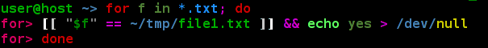

zsh-syntax-highlighting
=======================

Syntax highlighting for [Zsh](http://www.zsh.org).**

How to install
--------------

* Download the script or clone this repository:

        git clone git://github.com/jimmijj/zsh-syntax-highlighting.git

* Source the script **at the end** of `~/.zshrc`:

        source /path/to/zsh-syntax-highlighting/zsh-syntax-highlighting.zsh

* Source `~/.zshrc`  to take changes into account:

        source ~/.zshrc

How to tweak
------------

Syntax highlighting is done by pluggable highlighter scripts, see the [highlighters directory](highlighters)
for documentation and configuration settings.
